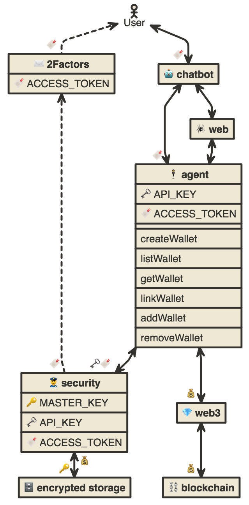
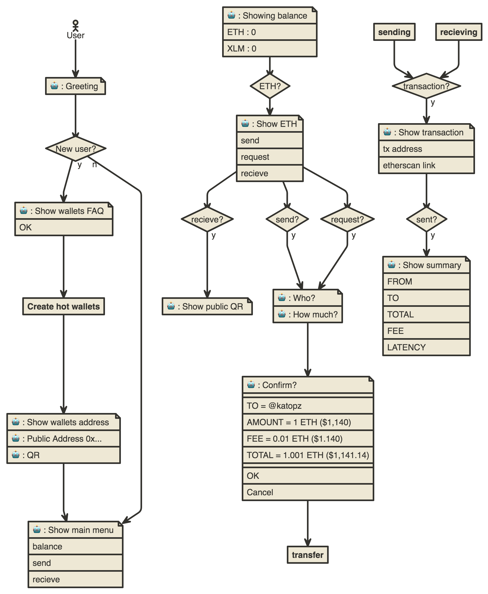

# catcat
CatCat Chatbot is here to help you securely transfer your coins


[EDIT](http://www.nomnoml.com/#view/%5B%3Cactor%3EUser%5D%3C--%F0%9F%94%96%5B%E2%9C%89%EF%B8%8F%202Factors%7C%F0%9F%94%96%20ACCESS_TOKEN%5D%0A%5B%3Cactor%3EUser%5D%3C-%3E%F0%9F%94%96%5B%F0%9F%A4%96%20chatbot%5D%0A%0A%5B%F0%9F%A4%96%20chatbot%5D%0A%5B%F0%9F%A4%96%20chatbot%5D%3C-%3E%F0%9F%94%96%5B%F0%9F%95%B4%20agent%5D%0A%5B%F0%9F%A4%96%20chatbot%5D%3C-%3E%5B%F0%9F%95%B7%20web%5D%0A%0A%5B%F0%9F%95%B7%20web%5D%3C-%3E%5B%F0%9F%95%B4%20agent%5D%0A%0A%5B%F0%9F%95%B4%20agent%7C%F0%9F%97%9D%20API_KEY%7C%F0%9F%94%96%20ACCESS_TOKEN%7C%7CcreateWallet%7ClistWallet%7CgetWallet%7ClinkWallet%7CaddWallet%7CremoveWallet%5D%0A%0A%5B%F0%9F%95%B4%20agent%5D%3C-%3E%F0%9F%97%9D%F0%9F%94%96%5B%F0%9F%91%AE%20security%5D%0A%0A%5B%E2%9C%89%EF%B8%8F%202Factors%5D%3C--%F0%9F%94%96%5B%F0%9F%91%AE%20security%5D%0A%5B%F0%9F%91%AE%20security%7C%F0%9F%94%91%20MASTER_KEY%7C%F0%9F%97%9D%20API_KEY%7C%F0%9F%94%96%20ACCESS_TOKEN%5D%F0%9F%92%B0%3C-%3E%F0%9F%94%91%5B%F0%9F%97%84%20encrypted%20storage%5D%0A%5B%F0%9F%95%B4%20agent%5D%3C-%3E%F0%9F%92%B0%5B%F0%9F%92%8E%20web3%5D%0A%5B%F0%9F%92%8E%20web3%5D%3C-%3E%F0%9F%92%B0%5B%E2%9B%93%20blockchain%5D)

## Hot wallets

[EDIT](http://www.nomnoml.com/#view/%5B%3Cactor%3EUser%5D-%3E%5B%3Cnote%3E%F0%9F%A4%96%20%3A%20Greeting%5D%0A%5B%3Cnote%3E%F0%9F%A4%96%20%3A%20Greeting%5D-%3E%5B%3Cchoice%3E%20New%20user%3F%5D%0A%2F%2F%20Create%0A%5B%3Cchoice%3E%20New%20user%3F%5Dy-%3E%5B%3Cnote%3E%F0%9F%A4%96%20%3A%20Show%20wallets%20FAQ%7COK%5D%0A%5B%3Cnote%3E%F0%9F%A4%96%20%3A%20Show%20wallets%20FAQ%7COK%5D-%3E%5BCreate%20hot%20wallets%5D%0A%5BCreate%20hot%20wallets%5D-%3E%5B%3Cnote%3E%F0%9F%A4%96%20%3A%20Show%20wallets%20address%7C%F0%9F%A4%96%20%3A%20Public%20Address%200x...%7C%F0%9F%A4%96%20%3A%20QR%5D%0A%5B%3Cnote%3E%F0%9F%A4%96%20%3A%20Show%20wallets%20address%5D-%3E%5B%3Cnote%3E%F0%9F%A4%96%20%3A%20Show%20main%20menu%7Cbalance%7Csend%7Crecieve%5D%0A%2F%2F%20Read%0A%5B%3Cnote%3E%F0%9F%A4%96%20%3A%20Showing%20balance%7CETH%20%3A%200%20%7CXLM%20%3A%200%5D-%3E%5B%3Cchoice%3EETH%3F%5D%0A%5B%3Cchoice%3EETH%3F%5D-%3E%5B%3Cnote%3E%F0%9F%A4%96%20%3A%20Show%20ETH%7Csend%7Crequest%7Crecieve%5D%0A%2F%2F%20Send%0A%5B%3Cnote%3E%F0%9F%A4%96%20%3A%20Show%20ETH%7Csend%7Crequest%7Crecieve%5D-%3E%5B%3Cchoice%3Erecieve%3F%5D%0A%5B%3Cchoice%3Erecieve%3F%5Dy-%3E%5B%3Cnote%3E%F0%9F%A4%96%20%3A%20Show%20public%20QR%5D%0A%2F%2F%20Recieve%0A%5B%3Cnote%3E%F0%9F%A4%96%20%3A%20Show%20ETH%7Csend%7Crequest%7Crecieve%5D-%3E%5B%3Cchoice%3Esend%3F%5D%0A%5B%3Cchoice%3Esend%3F%5Dy-%3E%5B%3Cnote%3E%F0%9F%A4%96%20%3A%20Who%3F%7C%F0%9F%A4%96%20%3A%20How%20much%3F%5D%0A%5B%3Cnote%3E%F0%9F%A4%96%20%3A%20Who%3F%5D%0A%5B%3Cnote%3E%F0%9F%A4%96%20%3A%20Who%3F%5D-%3E%5B%3Cnote%3E%F0%9F%A4%96%20%3A%20Confirm%3F%7C%7CTO%20%3D%20%40katopz%20%7C%20AMOUNT%20%3D%201%20ETH%20(%241%2C140)%7CFEE%20%3D%200.01%20ETH%20(%241.140)%7CTOTAL%20%3D%201.001%20ETH%20(%241%2C141.14)%20%7C%7COK%7CCancel%5D%0A%5B%3Cnote%3E%F0%9F%A4%96%20%3A%20Confirm%3F%5D-%3E%5Btransfer%5D%0A%5B%3Cnote%3E%F0%9F%A4%96%20%3A%20Show%20ETH%7Csend%7Crecieve%5D-%3E%5B%3Cchoice%3Erequest%3F%5D%0A%5B%3Cchoice%3Erequest%3F%5Dy-%3E%5B%3Cnote%3E%F0%9F%A4%96%20%3A%20Who%3F%5D%0A%2F%2F%20Sending%0A%5Bsending%5D-%3E%5B%3Cchoice%3Etransaction%3F%5D%0A%5B%3Cchoice%3Etransaction%3F%5Dy-%3E%5B%3Cnote%3E%F0%9F%A4%96%20%3A%20Show%20transaction%7Ctx%20address%7Cetherscan%20link%5D%0A%5B%3Cnote%3E%F0%9F%A4%96%20%3A%20Show%20transaction%5D-%3E%5B%3Cchoice%3Esent%3F%5D%0A%2F%2F%20Recieving%0A%5Brecieving%5D-%3E%5B%3Cchoice%3Etransaction%3F%5D%0A%2F%2F%20Done%0A%5B%3Cchoice%3Esent%3F%5Dy-%3E%5B%3Cnote%3E%F0%9F%A4%96%20%3A%20Show%20summary%7CFROM%7CTO%7CTOTAL%7CFEE%7CLATENCY%5D%0A%5B%3Cchoice%3E%20New%20user%3F%5Dn-%3E%5B%3Cnote%3E%F0%9F%A4%96%20%3A%20Show%20main%20menu%5D)

# Setup
```
cd firebase
firebase init
```

## Features
### Basic bank
- [x] Can create wallet
- [ ] Can and link it with Facebook Messenger user.
- [ ] Can show current balance of each wallet.
- [ ] Can validate wallet address.
- [ ] Can transfer coins at lowest rate or fastest time use.
- [ ] Can notify when transaction complete.

### Advance bank
- [ ] Can use 2 factors before transfer.
- [ ] Can schedule transfer w/ or w/o multisig.

### Basic trade
- [x] Can check current coins exchange rate.
- [ ] Can draw price chart.
- [ ] Can draw current price charts.
- [ ] Can give basic information about coin.

### Advance trade
- [ ] Can draw floor and ceiling chart.
- [ ] Can give signal before price go up.
- [ ] Can notify high profit ICO.

## Foo
Will handle chat related
### Price
- [x] `$omg`               // To get `OMG` price in `THB`.
- [x] `$omg eth`           // To get `OMG` price in `ETH`.
- [ ] `$`                  // To begin flow of `$` command and list last or top 4 symbols.
- [ ] `$$`                 // To repeat last `$` command.

### Help
- [ ] `?`                  // To ask for help.
- [ ] `?$`                 // To ask for help about `$`.
- [ ] `?#`                 // To ask for help about `#`.
- [ ] `?-`                 // To ask for help about `-`.
- [ ] `?+`                 // To ask for help about `+`.
- [ ] `?!`                 // To ask for help about `!`.
- [ ] `?~`                 // To ask for help about `~`.
- [ ] `?^`                 // To ask for help about `^`.
- [ ] `?omg`               // To ask for information about `OMG`.

### Send
- [ ] `-`                  // To begin flow of `-` command.
- [ ] `-100 omg @katopz`   // To send `100` as `OMG` to user name `@katopz`.
- [ ] `--`                 // To repeat last `-` command with prompt for `to` targeted user.
- [ ] `-omg`               // To send `OMG` with prompt for `value` then `to` targeted user.
- [ ] `-100 omg`           // To send `100` as `OMG` with prompt for `to` targeted user.

### Request
- [ ] `+`                  // To begin flow of `+` command.
- [ ] `+100 omg @katopz`   // To request for `100` as `OMG` from user name `@katopz`.
- [ ] `++`                 // To repeat last `+` command with prompt for `to` targeted user.
- [ ] `+omg`               // To request `OMG` with prompt for `value` then `to` targeted user.
- [ ] `+100 omg`           // To request `100` as `OMG` with prompt for `to` targeted user.

### Chart
- [ ] `#`                  // To begin flow of `#` command and list last or top 4 symbols.
- [ ] `#omg`               // To see `OMG` chart.
- [ ] `##`                 // To repeat last `#` command.
- [ ] `#omg xzc`           // To see `OMG` chart against `XZC`.

### Forecast
- [ ] `~`                  // To begin flow of `~` command and list last or top 4 symbols.
- [ ] `~omg`               // To get forecast about `OMG`.
- [ ] `~~`                 // To repeat last `~` command.

### Wallets
- [ ] `=`                  // To begin flow of `=` command.
- [ ] `=+`                 // To create new wallet, will show `ETH`, `XLM` options.
- [ ] `=+eth`              // To create new `ETH` wallet.
- [ ] `=+xlm`              // To create new `XLM` wallet.
- [ ] `=-`                 // To show list for remove wallet.

### Portfolio
- [ ] `^omg`                // To prompt for `value` as `OMG` and show profit as `%`.
- [ ] `^omg%`               // To prompt for `value` as `OMG` and show profit as `%`.
- [ ] `^omg thb`            // To prompt for `value` as `OMG` and show profit as `thb`.
- [ ] `^+100 omg`           // To prompt for `price` and `100 OMG` then add it to port.
- [x] `^+100 omg 123`       // To add `100 OMG`at `123 THB` to port and show summary.
- [x] `^+100 omg 123 usd`   // To add `100 OMG`at `123 USD` to port and show summary.
- [ ] `^-100 omg 345 thb`   // To remove `100 OMG`at `345 THB` to port and show summary.
- [ ] `^bx.csv`             // To prompt for choose `bx-*.csv` file from `bx` and show summary.
- [ ] `^`                   // To begin flow of `^` command and list last or top 4 symbols.
- [ ] `^^`                  // To repeat last `^` command.
- [ ] `^*`                  // To show portfolio summary.
- [ ] `^#`                  // To show portfolio history.
  ```
  💵 PORTFOLIO - 2017/12/23 16:30:11
  
  OMG 100/300 = 300% (+200 THB)
  ETH 100/200 = 200% (+100 THB)

  Profit 500% (+300 THB)
  ```
- [ ] `^omg?`               // To show summary for `OMG`.
  ```
  # Gain
  You have 1 OMG at 100 THB
  Current price from BX is 300 THB 
  So you have +300% profit gain!
  +200 THB) Congrats!

  # Lost
  You have 1 OMG at 100 THB
  Current price from BX is 50 THB
  So you have -50% profit lost, Cheers up!
  ```

### News
- [ ] `*`                   // To begin flow of `*` command and list last or top 4 symbols.
- [ ] `*omg`                // To get news about `OMG`
- [ ] `**`                  // To repeat last `*` command.

### Alert
- [ ] `!`                   // To begin flow of `!` command and list last or top 4 symbols.
- [ ] `!omg>5%`             // To alert when `OMG` price up `5%` from now.
- [ ] `!omg<5%`             // To alert when `OMG` price down `5%` from now.
- [ ] `!omg<300`            // To alert when `OMG` price less then `300`.
- [ ] `!omg>300`            // To alert when `OMG` price more then `300`.
- [ ] `!!`                  // To repeat last `!` command.

### Exchanges
- [ ] `%`                   // To begin flow of `%` command and list last or top 4 exchanges.
- [ ] `%%`                  // To repeat last `%` command.
- [ ] `%bitfinex`           // To select `bitfinex`

## Bar
Will handle coins related

## alpha
> `Ethereum` Hot Wallets
- [ ] Can create `ETH` wallet.
- [ ] Can show `ETH` wallet.
- [ ] Can access `ETH` wallet.
- [ ] Can send `ETH` via `@username`.
- [ ] Can send `USD` as `ETH`.
- [ ] Can send `THB` as `ETH`.
- [ ] Can receive `ETH`.
- [ ] Can show sending transaction.
- [ ] Can show sent transaction.
- [ ] Can send/receive `ETH` via `email` as link callback.
- [ ] Can request `ETH` via `email` as link callback.
- [ ] Can request `ETH` via `@username`.
- [ ] Can send `ETH` via `public key`.

## beta
> `Stellar` Hot Wallets
- [ ] Can use `ETH` to create `XLM` wallet.
- [ ] Can show/manage `XLM` wallet.
- [ ] Can send/receive/request `XLM`.

## v1
> Web Warm Wallets
- [ ] Can verify email
- [ ] 2factor with email : Can send mail about wallet and secret
- [ ] [web] Can add `ETH`/`XLM` wallet from public key.
- [ ] [web] Can ask for private key to unlock/sign tx.
- [ ] [web] Can use `metamask` for unlock/sign tx.
- [ ] [web] Can remove wallets.

## v2
- [ ] Can exchange between `ETH` and `XLM` : https://github.com/rabbotio/stellereum-api

## v3
- [ ] Can create multisig wallet : https://github.com/gnosis/MultiSigWallet

## v4
- [ ] Can create schedule transfer.
- [ ] Can cancel scheduled transfer. 